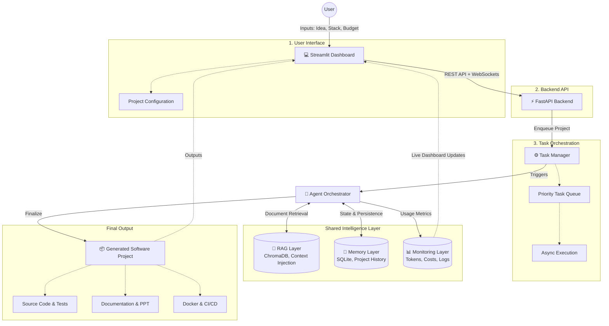
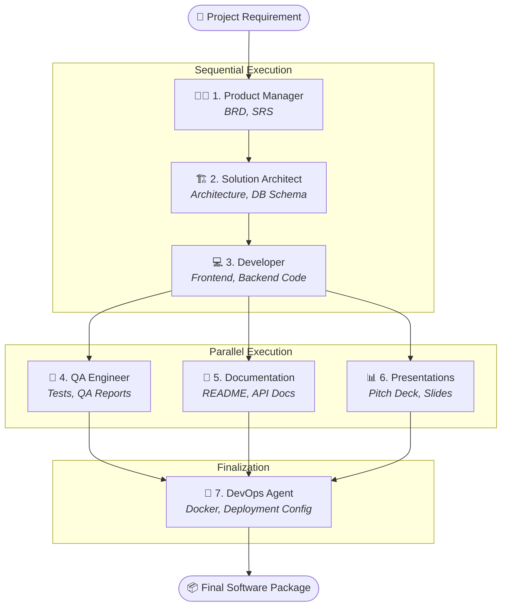

<div align="center">
  
  
  
  
  
  <h1>⚡ AgentForge</h1>
  <p><strong>Autonomous Multi-Agent Software Engineering Platform</strong></p>
  <p><i>Transform natural language ideas into comprehensive software project drafts using an orchestrated team of specialized AI agents.</i></p>
</div>

---

## 📖 Overview

**AgentForge** is an advanced AI-driven software engineering orchestrator built by **Abilash Aruva**. It acts as an autonomous virtual software company, where 7 specialized AI roles seamlessly collaborate to take a project from initial concept to a generated codebase, complete with documentation, tests, and deployment scripts.

Unlike standard code-generation tools, AgentForge models the entire software development lifecycle (SDLC). It maintains deep context via Retrieval-Augmented Generation (RAG) and persistent memory, ensuring architectural consistency across the entire pipeline.

## 🚀 Why AgentForge?

Basic AI coding chatbots are great for single-file scripts, but they lose context when building complex applications. AgentForge solves this by employing a complete autonomous workflow:

- **Specialized Agents**: 7 distinct AI roles (PM, Architect, Developer, etc.) each handle a specific phase of the SDLC.
- **SDLC Orchestration**: A structured pipeline ensures requirements are written before architecture is designed, and architecture is designed before code is written.
- **Shared Context (RAG)**: Uses ChromaDB to ensure that the Developer agent has access to the exact specifications written by the Architect.
- **Persistent Project Memory**: SQLite tracks the exact state of the project, allowing you to monitor progress across all agents.
- **Task Management**: An asynchronous priority queue handles multiple project generation tasks in the background.
- **Monitoring & Token Tracking**: Accurately tracks LLM token usage and estimated costs natively, enforcing configurable USD budgets.

## 🏗️ Architecture & Workflow

AgentForge operates on a robust, decoupled architecture separating the user interface, backend task queue, and agent reasoning engine.

### End-to-End System Architecture



### Specialized Agent Execution Flow



## 💡 Example: Input → Output

*(Illustrative Example)*

**Input**: *"Build a URL shortener with FastAPI and React, using a PostgreSQL database."*

**What the pipeline generates**:
1. **Product Manager**: Generates a detailed Business Requirement Document (BRD) and Software Requirements Specification (SRS), outlining the core user journeys (e.g., short link creation, analytics dashboard).
2. **Solution Architect**: Designs the technical architecture, defines the PostgreSQL database schema (Tables: `Users`, `Urls`, `Clicks`), and creates the API specifications.
3. **Developer**: Writes the actual FastAPI backend routes and React frontend components based precisely on the Architect's schemas.
4. **QA Engineer**: Generates Unit and Integration test files for the FastAPI routes.
5. **Documentation**: Writes a comprehensive `README.md` and setup guide for the generated project.
6. **Presentations**: Drafts a pitch deck outlining the value proposition of the new URL shortener.
7. **DevOps**: Generates a `Dockerfile` for the backend, a `Dockerfile` for the frontend, and a `docker-compose.yml` to orchestrate them alongside PostgreSQL.

## 📸 Screenshots / Demo

*(Awaiting Screenshots. When ready, add real screenshots of the Streamlit Dashboard, Project Configuration Screen, and the Real-Time Terminal View here to demonstrate the working UI).*

## 🛠️ Technology Stack

- **Frontend**: Streamlit, WebSockets, Vanilla CSS (Glassmorphism UI)
- **Backend**: FastAPI, Uvicorn, Asyncio Task Queues
- **Database**: SQLite (Relational State), ChromaDB (Vector RAG)
- **AI Engine**: MetaGPT Framework
- **LLM Integration**: OpenAI, Gemini, Azure (Configurable)

## 📦 Installation & Setup

1. **Clone the repository:**
   ```bash
   git clone https://github.com/Abilash77/agentforge-agentic-ai.git
   cd agentforge-agentic-ai
   ```

2. **Set up a virtual environment:**
   ```bash
   python -m venv venv
   source venv/bin/activate  # On Windows use `venv\Scripts\activate`
   ```

3. **Install dependencies:**
   ```bash
   pip install -r agentforge_requirements.txt
   pip install -r requirements.txt
   ```

4. **Configure Environment Variables:**
   Copy the example environment file:
   ```bash
   cp agentforge/.env.example agentforge/.env
   ```
   Add your preferred LLM API keys to `agentforge/.env` (e.g., `OPENAI_API_KEY`). Ensure `LLM_API_TYPE` and `LLM_MODEL` are set correctly.

## 🎮 Usage

1. **Start the FastAPI Backend:**
   Open a terminal and start the backend orchestration server on port 8001:
   ```bash
   python -m uvicorn agentforge.api.main:app --host 0.0.0.0 --port 8001
   ```

2. **Start the Streamlit Frontend:**
   Open a second terminal and launch the UI on port 8501:
   ```bash
   streamlit run agentforge/frontend/app.py
   ```

3. **Launch a Project:**
   Navigate to `http://localhost:8501`. Enter your project idea, select a tech stack, set your maximum LLM token budget, and hit Launch!

## 🔧 Troubleshooting

- **Missing API Keys**: If the pipeline immediately fails, ensure your `agentforge/.env` file contains a valid `LLM_API_KEY` and that you have sufficient billing credits with your provider.
- **Backend Not Running**: If the Streamlit frontend shows connection errors, ensure the FastAPI backend is actively running on port 8001 in a separate terminal.
- **Frontend/Backend Connection Issues**: If WebSocket updates are failing, verify that `API_HOST` and `API_PORT` in your `.env` match the backend server configuration.
- **ChromaDB Connection Problems**: If you encounter vector database lock errors, ensure no other processes are accessing the `agentforge/data/chroma` directory. You can safely delete this directory to reset the vector store state.
- **Dependency Installation Problems**: If `pip install` fails, ensure you are running Python 3.9, 3.10, or 3.11, as some AI dependencies may not yet fully support Python 3.12+.

## 📜 Acknowledgments & Attribution

AgentForge is powered by MetaGPT, a powerful multi-agent framework.

---

### GitHub Portfolio Recommendations

**Repository Topics**: `agentic-ai`, `multi-agent-systems`, `fastapi`, `streamlit`, `rag`, `chromadb`, `software-engineering`, `llm`, `metagpt`
