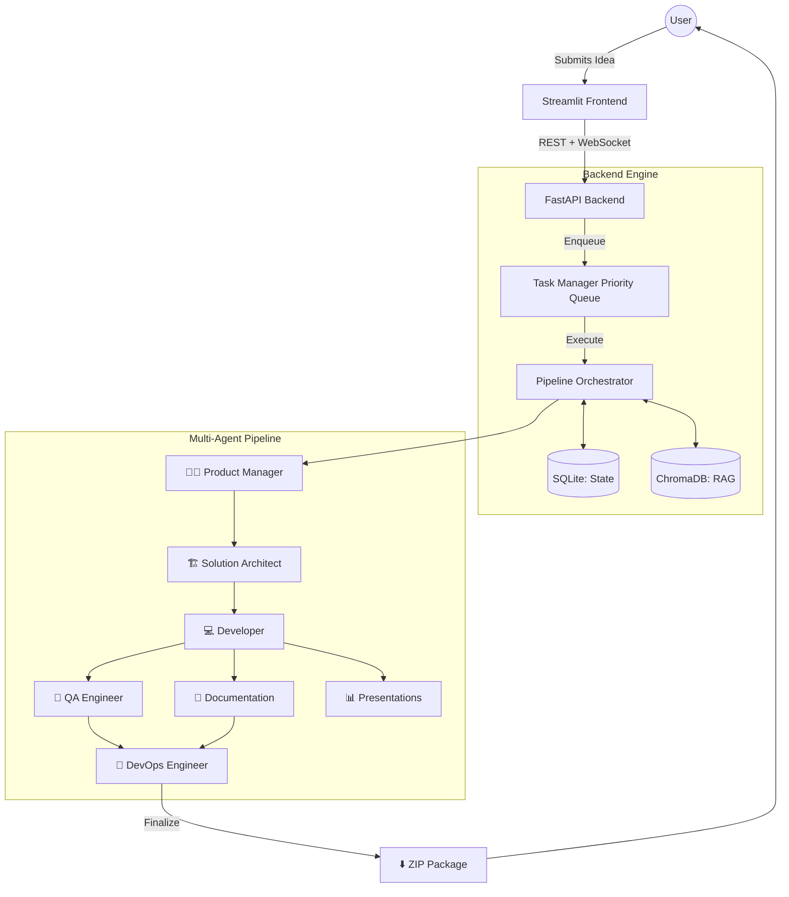

<div align="center">
  
  
  
  
  
  
  <h1>⚡ AgentForge</h1>
  <p><strong>Autonomous Multi-Agent Software Engineering Platform</strong></p>
  <p><i>Transform natural language ideas into production-ready software using an orchestrated team of specialized AI agents.</i></p>
</div>

---

## 📖 Overview

**AgentForge** is an advanced AI-driven software engineering orchestrator built by **Abilash Aruva**. It acts as an autonomous virtual software company, where 7 specialized AI roles seamlessly collaborate to take a project from initial concept to a fully coded, tested, and documented software package. 

Unlike standard code-generation tools, AgentForge models the entire software development lifecycle (SDLC). It maintains deep context via Retrieval-Augmented Generation (RAG) and persistent memory, ensuring architectural consistency across the entire pipeline.

## 🚀 Key Features

- **Multi-Agent Pipeline**: Specialized AI roles (Product Manager, Architect, Developer, QA, DevOps, Documentation, Presentations) collaborate dynamically.
- **Real-Time Monitoring**: A beautiful, glassmorphism-styled Streamlit dashboard connects via WebSockets to provide live terminal logs, cost updates, and pipeline progress.
- **RAG & Persistent Memory**: Integrates ChromaDB and SQLite to maintain deep project history and context across agent executions, ensuring no context is lost between the Architect and the Developer.
- **Cost & Token Tracking**: Tracks LLM token usage natively, ensuring projects stay within configurable budgets (USD).
- **Asynchronous Task Management**: Supports concurrent background project executions using an asynchronous priority queue.

## 🏗️ Architecture & Workflow

AgentForge operates on a robust, decoupled architecture separating the user interface, backend task queue, and agent reasoning engine.



### The Agent Workflow

1. **👩‍💼 Product Manager**: Analyzes the raw idea, asks clarifying questions, and generates a Business Requirement Document (BRD) and Software Requirements Specification (SRS).
2. **🏗️ Solution Architect**: Designs the technical architecture, database schemas, and C4 system diagrams based on the PM's specifications.
3. **💻 Developer**: Writes the actual source code (Frontend and Backend) implementing the architecture.
4. **🧪 QA Engineer**: Generates Unit, Integration, and End-to-End (E2E) test suites. *(Runs concurrently)*
5. **📝 Documentation**: Writes the final `README.md`, setup guides, and API documentation. *(Runs concurrently)*
6. **📊 Presentations**: Generates pitch decks and investor slides. *(Runs concurrently)*
7. **🐳 DevOps**: Reviews the final codebase to generate Dockerfiles, Kubernetes manifests, and CI/CD pipelines.

## 🛠️ Technology Stack

- **Frontend**: Streamlit, WebSockets, Vanilla CSS (Glassmorphism UI)
- **Backend**: FastAPI, Uvicorn, Asyncio Task Queues
- **Database**: SQLite (Relational State), ChromaDB (Vector RAG)
- **AI Engine**: MetaGPT Framework
- **LLM Integration**: OpenAI, Gemini, Azure (Configurable)

## 📦 Installation & Setup

1. **Clone the repository:**
   ```bash
   git clone https://github.com/Abilash77/agentforge-agentic-ai.git
   cd agentforge-agentic-ai
   ```

2. **Set up a virtual environment:**
   ```bash
   python -m venv venv
   source venv/bin/activate  # On Windows use `venv\Scripts\activate`
   ```

3. **Install dependencies:**
   ```bash
   pip install -r agentforge_requirements.txt
   pip install -r requirements.txt
   ```

4. **Configure Environment Variables:**
   Copy the example environment file:
   ```bash
   cp agentforge/.env.example agentforge/.env
   ```
   Add your preferred LLM API keys to `agentforge/.env` (e.g., `OPENAI_API_KEY`, `GEMINI_API_KEY`).

## 🎮 Usage

1. **Start the FastAPI Backend:**
   Open a terminal and start the backend orchestration server:
   ```bash
   python -m uvicorn agentforge.api.main:app --host 0.0.0.0 --port 8001
   ```

2. **Start the Streamlit Frontend:**
   Open a second terminal and launch the UI:
   ```bash
   streamlit run agentforge/frontend/app.py
   ```

3. **Launch a Project:**
   Navigate to `http://localhost:8501`. Enter your project idea, select a tech stack (e.g., FastAPI + React), set a budget, and hit Launch! Track the agents in real-time on the Project Dashboard.

## ⚠️ Limitations & Roadmap

- **LLM Hallucinations**: Code generated by the Developer agent is highly dependent on the quality of the underlying LLM. GPT-4 Turbo or Claude 3.5 Sonnet are highly recommended.
- **Roadmap**: 
  - Add native GitHub integration to automatically push generated code to a repository.
  - Implement human-in-the-loop (HITL) approval steps before the Developer agent executes.

## 📜 Acknowledgments & Attribution

AgentForge is powered by MetaGPT, a powerful multi-agent framework.

---

### GitHub Portfolio Recommendations

**Repository Topics**: `agentic-ai`, `multi-agent-systems`, `fastapi`, `streamlit`, `rag`, `chromadb`, `software-engineering`, `llm`, `metagpt`
